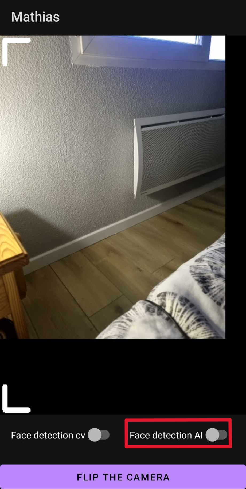

# Développement Mobile Avancé

### Authors
AJOUC Mathias <br>
CHESNEAU Simon

<h1>Compréhension du code donné:</h1>
<h2>Structure du code :</h2>
<p>
Le code s'organise autour de deux parties. Une partie écrite en Java nommée MainActivity permet de gérer le cycle de vie de l'application, les permissions et l'interface utilisateur. Et une partie native codée en C++ permet d'utiliser les composantes natives du téléphone (caméra) et des librairies C++ pour du traitement ou de la communication. Pour communiquer, ces deux parties utilisent une JNI ou Java-Native-Interface qui permet de faire communiquer les deux langages.

Le plus gros du code fourni se trouve du côté natif et est structuré comme suit :

1. CV_Manager : <br><br>
C'est la classe principale qui compose le code natif. Elle contient des méthodes qui permettent de faire appel aux fonctionnalités des librairies, comme par exemple SetUpCamera(), SetUpEncoder() ou encore CameraLoop().

2. native-lib : <br><br>
C'est dans ce fichier que sont définis les appels à la JNI. On définit des fonctions en C++ qui pourront être appelées depuis le code Java. C'est ici que l'on instancie le CV_Manager et que l'on crée le thread pour la CameraLoop().

3. Les librairies : <br><br>
Ce sont différents fichiers qui utilisent des librairies externes pour des opérations de traitement. L'encoder, par exemple, permet d'encoder les images enregistrées par la caméra.
</p>

<h1>Modifications du code donné:</h1>
<h2>Renforcement du code :</h2>
<h3>Problème</h3>
<p>
Lors de l'installation de l'application sur le téléphone de mathias, un bug jusque là jamais apparus s'est mis a survenir de manière aléatoire. Après avoir investigué le sujet, nous nous sommes rendu compte que certains téléphone alloue des zone de mémoire normalement interdite, engendrant la non réation d'objets C++ et donc des nullpointers par la suite.
</p>

<h3>Résolution</h3>
<p>
Afin de rendre le code plus robuste et consistant, nous avons identifié les endroits sur lesquels cette erreur se produisait.
Heureusement pour nous, cela ne se produisait que lors de l'initialisation de l'encodeur. Nous avons donc ajouté une boucle initialisant l'encodeur tant que celui-ci n'était pas créé entièrement. 
</p>
<h4>Code précédent</h4>

```c++
m_Encode = new Encoder();
m_Encode->setSocketClientH264(m_socket);
m_Encode->InitCodec(400, 608, 15, 20000);
test = m_Encode->getStatus();
```

<h4>Code mis à jours</h4>

```c++
do {
        m_Encode = new Encoder();
        m_Encode->setSocketClientH264(m_socket);
        m_Encode->InitCodec(400, 608, 15, 20000);
        test = m_Encode->getStatus();
}while(test != AMEDIA_OK);    
```

<p>
De cette manière, le statut de l'encodeur doit forcément être <code>AMEDIA_OK</code> pour pouvoir passer à la suite. <br>
Cette partie nous a semblée essentielle, malgrés le besoin de cette évaluation, car cela permet a tout portable android de passer cette erreur, et non uniquement les plus chanceux.
</p>

<h3>Récupération automatique de la taille de l'image à l'initialisation de l'encodeur</h3>

<p>
Jusqu'ici, nous donnions manuellement les dimensions de l'image à l'encodeur. Nous avons décidé de rendre cette partie automatique pour éviter des erreurs de segmentation lors du <code>memcpy</code> effectué sur les buffers d'images. 
</p>

<h4>Code précédent</h4>
<p>Précédemment nous utilisions le <code>SetUpEncoder</code> pour spécifier les dimensions des images</p>

```c++ 
m_Encode->InitCodec(400, 608, 15, 20000);
```

<h4>Code mis à jours</h4>
<p>
Lors de la récupération de la première image, nous envoyons ses dimensions au serveur.
C'est a ce moment que nous initialisons les bonnes dimensions d'image à l'encodeur afin qu'il puisse les encoder sans erreurs.
</p>

```c++
do {
m_Encode->InitCodec(display_mat.rows, display_mat.cols, 15, 20000);

m_retrievedImageWidth = display_mat.cols;
m_retrievedImageHeight = display_mat.rows;

}while(m_Encode->getStatus() != AMEDIA_OK);
```

<p>
Cette partie nous a semblé essentielle, de la même manière que la première, car elle permet de lancer le programme sur n'importe quel portable, peu importe le type de caméra utilisé et les dimensions de l'image capturé.
</p>

<h2>Ajout de nouvelles fonctionnalités</h2>

<p>
Le sujet de cette évaluation était d'ajouter de nouvelles fonctionnalités a l'application. Nous avons donc décidé d'implémenter de la reconnaissance de forme et plus spécifiquement, la reconnaissance de visages. Pour ce faire, nous avons utilisé deux méthodes distinctes. 
<br> <br>
Nous avions initialement prévu de n'implémenter qu'une seule méthode pour la detection de visage et d'ajouter d'autres fonctionnalités. Cependant, après 2 jours d'essais infructueux avec la librairie OpenCV, nous nous sommes tournés vers une méthode basé sur de l'IA. Après de premiers essais concluant avec IA, et malgrès notre frustration, nous avons décidés de terminer l'implémentation de la librairie d'OpenCV dans le but de faire un comparatif de performance entre les techniques utilisées. 
Les 2 implémentations sont disponibles dans la version finale, avec un moyen de les activer et désactiver.
</p>

<h3>Détéction de visages via une IA</h3>
<p>La détéction de visage via une IA à été la première implémentation à avoir marchée. Cette implémentation, faite via le tutorial présent sur <a href="https://medium.com/analytics-vidhya/building-a-face-detector-with-opencv-in-c-8814cd374ea1">ce lien</a>.</p>

<h4>Implémentation</h4>
<p>Lors du lancement, il est possible de séléctionner l'option de détection de visage en utilisant de l'IA:</p>




<p>En selectionnant cette option, vous permettez que l'image passent par la méthode <code>AIFaceDetection</code> du <code>CV_Manager</code>.
cette fonction utilisera les fichiers <code>deploy.prototxt</code> et <code>res10_300x300_ssd_iter_140000_fp16.caffemodel</code> présente dans <code>assets</code> afin de pouvoir setup les poids de l'IA dans le but qu'elle puisse détecter les visages.</p>

<h4>Problèmes rencontrés</h4>
<p>Au cours de cette implémentation, un problème majeur à été rencontrés: queles sont les valeurs des pparamètres a mettre afin que l'IA ne soit pas trop sensible (ne détecte pas trop de visage s'il n'y en a pas), mais qu'elle puisse tous de même détecter un visage. Avec les paramètres actuels, le résultat est satisfaisant, mais nécessite d'être assez loins de la caméra afin qu'elle détecte le visage. Cela est toujours mieux que le premier essai ci-dessous</p>


<h3>Détection de visages via openCV</h3>
<p>OpenCV est la première méthode que nous avons trouvé et essayer d'implémenter. Malheureusement, elle est aussi la dernière que nous avons réussi a faire fonctionner.</p>
<h4>Implémentation</h4>
<p>Lors du lancement, il est possible de séléctionner l'option de détection de visage en utilisant de openCV:</p>

<p>De la même manière que pour la détection de visage par IA, en séléctionnant cette option, vous permettez que l'image passe par la méthode <code>CVFaceDetection</code> de <code>CV_Manager</code>. Cette fonction utilisera le fichier <code>haarcascade_frontalface_default.xml</code> présent dans <code>assets</code> dans le but dé détecter les visages en utilisant une <code>cascade</code>.</p>

<h4>Problèmes rencontrés</h4>
<p>La raison pour laquelle nous n'avons pas réussi a utiliser openCV dans un premier temps viens d'un problème très simple: la cascade. En effet, la cascade est l'outil principal permettant de détecter les visages, et pour initialiser cet objet en c++, il faut lui donner un lien en texte danns la méthode <code>load("link")</code>. Malheureusement, openCV n'est pas capable d'aller ouvrir les fichiers. Il est donc presque impossible de faire fonctionner cette méthode.</p>
<p>A force de recherche, nous avons découvert qu'il était possible de récupéré cet objet via la partie Java du code et de la passer au C++ en usilisant un <code>AssetManager</code>. Nous avons donc créer l'un de ces objets récupérant notre fichier, puis le donnant a notre objet <code>cascade</code> via la fonction <code>read(node)</code>. En utilisant les <code>FileStorage</code> (fs) d'openCV, nous pouvons ouvrir le fichier. Il ne nous reste plus qu'a le transformer en Node en utilisant la méthode <code>root()</code>. Malheureusement, c'est là que nous avons rencontrés notre problème. utiliser <code>cascade.read(fs.root());</code>, n'est pas capable d'initialiser la cascade. Après beaucoup de recherche, nous avons abandonné cette méthode puisque tant que la cascade n'était pas initialiser, nous ne pouvions rien détecter.</p>
<p>La résolution qui a été trouvé par la suite, à été trouvé par hasard. En effet, en éssayant de revenir au code précédent (supprimé par erreur), nous avons utiliser une autre méthode du <code>FileStorage</code> permettant d'obtenir une <code>Node</code>. Ceci nous a permis d'initialiser la cascade et de détecter les visages. La ligne <code>cascade.read(fs.root());</code> est devenu: <code>cascade.read(fs.getFirstTopLevelNode());</code></p>

<h3>Ajout de petites décoration sur la caméra</h3>
<p>Dans un but d'essayer de reproduire l'effet de caméra du jeu outlast, nous avons ajouter quelques petits traits sur l'image. Malheureusement, l'implémentation des détection de visages nous ayant pris trop de temps, nous n'avons pas été capable d'aller plus loins que les 4 coins de la caméra.</p>

